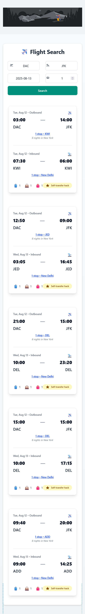

# Flight Search Web App

A simple and responsive flight search web application that uses the Amadeus Flight Offers API to search for flights by origin, destination, date, and number of passengers.

---

## Features

- Search flights by **origin**, **destination**, **departure date**, and **passengers**  
- Display flight results including airline, stops, price, and duration  
- Responsive design for both desktop and mobile devices  
- Loading spinner during API requests  
- Proper error handling for API failures or no results  
- Clean and maintainable React code  

---

## Demo Screenshots

### Desktop View  


### Mobile View  


---

## Installation & Setup

1. Clone the repository:
   ```bash
   git clone https://github.com/abu-musa-dev/flight-search-app.git
